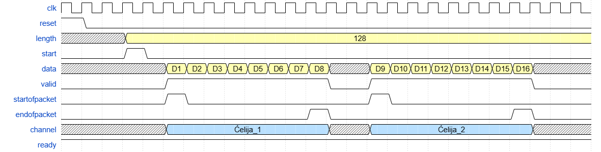

# Arhitekture paketskih čvorišta
 Projekat: Konverter paketa u ćelije
## Opis projekta

Cilj ovog projekta je modeliranje i implementacija sklopa za konverziju paketa u ćelije. 
Projekat koristi 8-bitni Avalon ST interfejs za prijem Ethernet okvira proizvoljne dužine (64-1500 bajta) i generiše izlazni tok fiksnih ćelija dužine 64 bajta. 

### Specifikacija:

- **Ulaz:** 8-bitni Avalon ST interfejs koji prima Ethernet pakete.
- **Izlaz:** 8-bitni Avalon ST interfejs koji generiše niz ćelija fiksne dužine (64 bajta).
- **Proces:**
  - Paket se dijeli na ćelije od 64 bajta.
  - Broj ćelija, \( N \), definisan je kao \( N = [{Veličina paketa} / 64 ]
  - Svaka ćelija prenosi dijelove paketa sa ulaznog interfejsa.
  - Posljednja ćelija se dopunjava nulama (zero padding) do dužine od 64 bajta.
- **Signalizacija:**
  - Početak i kraj ćelije označeni su signalima `sop` (start of packet) i `eop` (end of packet).
  - Paralelno sa podacima, izlazni interfejs prenosi `channel` signal koji sadrži:
    - Redni broj paketa.
    - Redni broj ćelije unutar paketa.

### Avalon ST interfejs

`Avalon streaming interfejs (Avalon ST)` je interfejs koji podržava jednosmjerni tok podataka, uključujući multipleksirane tokove, pakete i DSP podatke. [^1]

Tipični sistem koji koristi Avalon ST interfejse kombinira više funkcionalnih modula, koji se zovu komponente. "System designer" omogućava konfigurisanje komponenata i njihovo povezivanje kako bi se implementirao sistemi. [^1]

### WaveDrom

#### Grafik:

#### Grafik sa zero padding-om:

<!-- Također se može koristiti  za umetanje slike u README.md -->

Kada je u pitanju grafik sa zero padding-om, karakteristično je to što se veličina length signala promijeni sa 128 na 120. Pored prethodno spomenutog, ZP se pojavljuje umjesto D16 u data signalu.

`Zero padding` je tehnika koja se obično koristi u obradi digitalnih signala kako bi se standardizirale dimenzije, osigurale optimalne performanse i očuvala prvobitna struktura ulaznih podataka. Ova tehnika podrazumijeva dodavanje nula ulaznim podacima kako bi se osiguralo da podaci imaju specifičan oblik koji je pogodan za daljnju obradu. Iako ova tehnika dodatno opterećuje procesor, to je gotovo neznatno i prednosti kao što su očuvanje veličine podataka i povećana preciznost analize podataka čine ovu tehniku neophodnom. [^2]

#### Signali 8-bitnog Avalon ST interfejsa

<u>_WaveDrom grafik 8-bitnog Avalon ST interfejsa koji konvertuje pakete u ćelije se sastoji od sljedećih signala:_</u>

- **`clk`** - Takt signal sistema koji usklađuje sve operacije;
- **`reset`** - Signal za resetiranje koji sistem vraća u početno stanje;
- **`length`** - Ovaj signal označava veličinu podatkovnog paketa;
- **`start`** - Signal koji označava početak prijenosa podataka;
- **`data`** - Signal koji označava podatke koji se prenose;
- **`valid`** - Kada je ovaj signal aktivan, to znači da su podaci u data signalu ispravni i da se mogu koristiti od strane odredišta;
- **`startofpacket`** - Signal koji označava početak prijenosa paketa;
- **`endofpacket`** - Signal koji označava kraj prijenosa paketa;
- **`channel`** - Signal koji označava kanal koji se prenosi;
- **`ready`** - Signal koji označava da je odredište spremno primiti podatke. 

## Reference

[^1]: © Intel Corporation. [Intel Avalon-ST Interface](https://www.intel.com/content/www/us/en/docs/programmable/683647/18-0/avalon-st-interface.html)
[^2]: GeeksForGeeks Sanchhaya Education Private Limited, (17 Sep, 2024). [GeeksForGeeks - Zero Padding in Deep Learing and Signal Processing](https://www.geeksforgeeks.org/zero-padding-in-deep-learning-and-signal-processing/)

