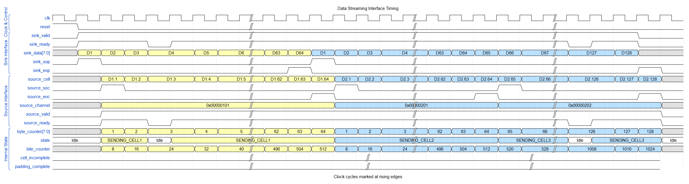
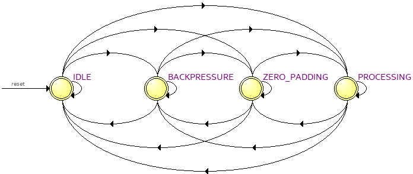
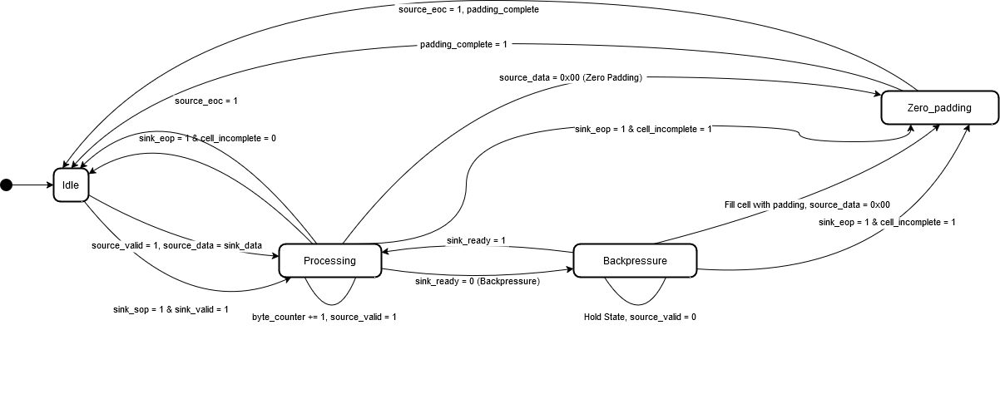
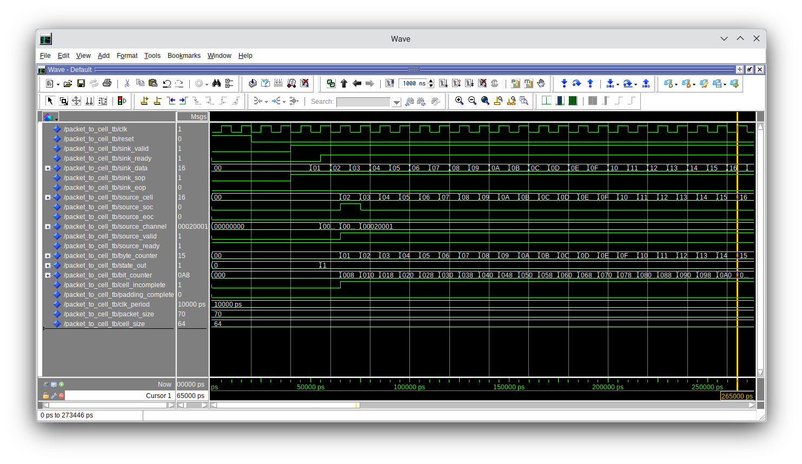
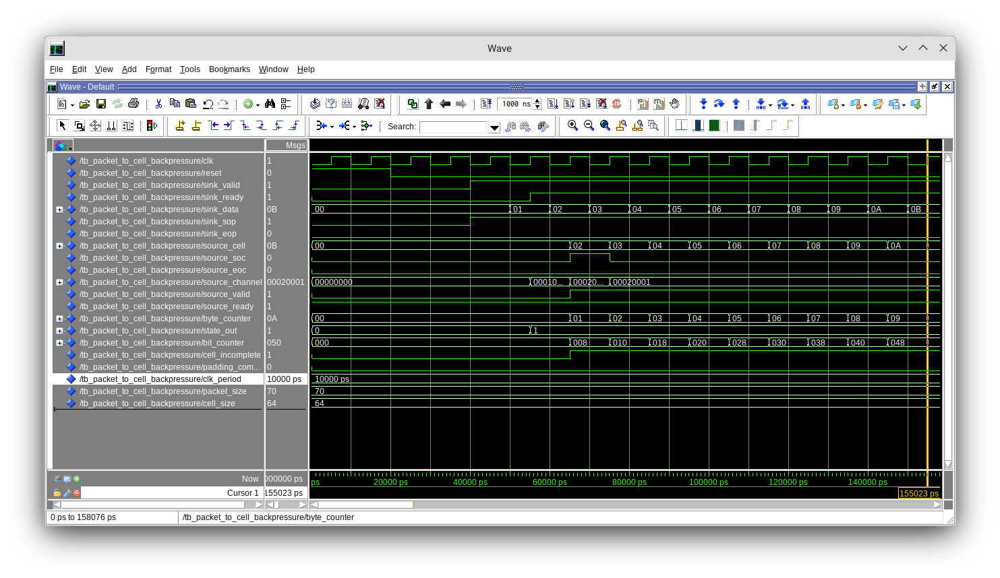
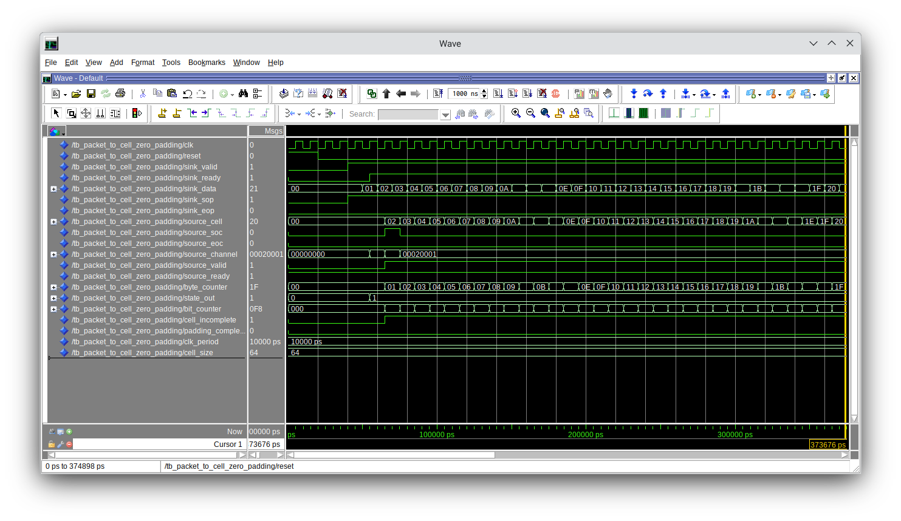
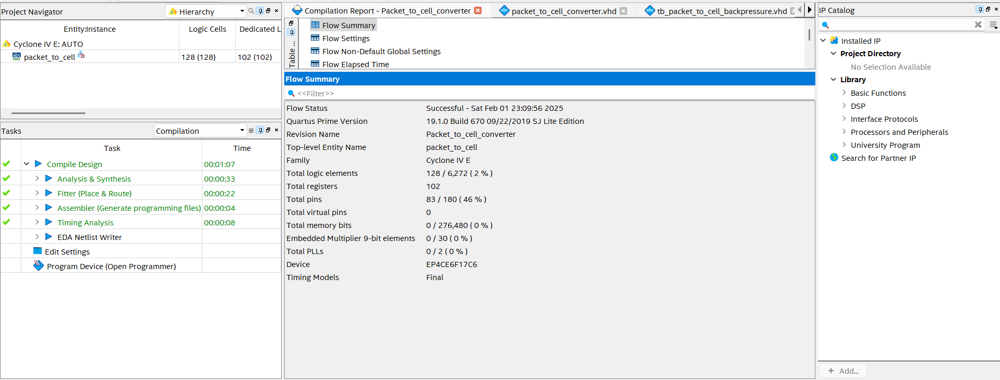

# Arhitekture paketskih čvorišta - Konverter paketa u ćelije

## Opis projekta

Cilj ovog projekta je modeliranje i implementacija sklopa za konverziju paketa u ćelije. 
Projekat koristi 8-bitni Avalon ST interfejs za prijem Ethernet okvira proizvoljne dužine (64 - 1500 bajta) i generiše izlazni tok fiksnih ćelija dužine 64 bajta. 

### Specifikacija:

| Stavka | Opis |
| -------- | ------ |
| **Ulaz:** | 8-bitni Avalon ST interfejs koji prima Ethernet pakete. |
| **Izlaz:** | 8-bitni Avalon ST interfejs koji generiše niz ćelija fiksne dužine (64 bajta). |
| **Proces:** | Paket se dijeli na ćelije od 64 bajta.  Broj ćelija, \(N\), definisan je kao \(N\) = {[Veličina paketa] / 64}   Svaka ćelija prenosi dijelove paketa sa ulaznog interfejsa.   Posljednja ćelija se dopunjava nulama (zero padding) do dužine od 64 bajta. |
| **Signalizacija:** | Početak i kraj ćelije označeni su signalima `sop` (start of packet) i `eop` (end of packet).   Paralelno sa podacima, izlazni interfejs prenosi `channel` signal koji sadrži: <ul><li>Redni broj paketa,</li><li>Redni broj ćelije unutar paketa.</li></ul> |

---

## Avalon ST interfejs

**Avalon streaming interfejs (Avalon ST)** je interfejs koji podržava jednosmjerni tok podataka, uključujući multipleksirane tokove, pakete i DSP podatke. [^1]

Tipični sistem koji koristi Avalon ST interfejse kombinira više funkcionalnih modula, koji se zovu komponente. "System designer" omogućava konfigurisanje komponenata i njihovo povezivanje kako bi se implementirao sistem. [^1]

---

## WaveDrom

### Konverter paketa u ćelije

*WaveDrom signali Avalon ST konvertera paketa u ćelije prikazani su na slici 1:*

<em>Slika 1: Konverter paketa u ćelije</em>

Dvije vijugave linije na ovom i ostalim graficima označavaju skokove, tj. radi pojednostavljenja grafika se ne prikazuju svi podaci koji se prenose. Kod `source_channel` signala možemo vidjeti tri vrijednosti koje su različito obojene. Žuta boja predstavlja prvi kanal, plava predstavlja drugi kanal, a crvena predstavlja drugi dio drugog kanala.

### Signali grafika konvertera paketa u ćelije:

*WaveDrom grafik 8-bitnog Avalon ST interfejsa koji konvertuje pakete u ćelije se sastoji od sljedećih signala:*

- `clk` - Takt signal sistema koji usklađuje sve operacije;
- `reset` - Signal za resetiranje koji sistem vraća u početno stanje;
- `sink_valid` - Označava da su ulazni podaci validni;
- `sink_ready` - Označava da je "sink" modul spreman primiti podatke;
- `sink_data[7:0]` - 8-bitni podatkovni signal na "sink" strani Avalon ST interfejsa. Služi za prijenos payload-a tokom svakog takta;
- `sink_sop` - Ovaj signal označava prvi takt podatkovnog paketa koji ulazi u interfejs, tj. početak paketa;
- `sink_eop` - Ovo je posljednji takt podatkovnog paketa, označava gdje se završava paket;
- `source_cell` - Prenosi podatke u formatu ćelija koje su kreirane iz ulaznih paketa;
- `source_soc` - Ovaj signal označava početak generisane ćelije;
- `source_eoc` - Ovaj signal označava kraj generisane ćelije;
- `source_channel` - Omogućava višekanalni prijenos podataka. To je signal koji označava identifikator kanala sa kojeg podaci dolaze;
- `source_valid` - Označava da su izlazni podaci spremni za prijenos;
- `source_ready` - Označava da je izlazni interfejs spreman primiti nove podatke;
- `byte_counter[7:0]` - 8-bitni signal koji je brojač bajta i prati broj prenesenih bajta;
- `state` - Trenutno stanje FSM-a (Idle, SENDING_CELL);
- `bit_counter` - Brojač bita koji prati broj prenesenih bita.

### Zero padding

 **Zero padding** je tehnika koja se obično koristi u obradi digitalnih signala kako bi se standardizirale dimenzije, osigurale optimalne performanse i očuvale prvobitna struktura ulaznih podataka. Ova tehnika podrazumijeva dodavanje nula ulaznim podacima kako bi se osiguralo da podaci imaju specifičan oblik koji je pogodan za daljnju obradu. Iako ova tehnika dodatno opterećuje procesor, to je gotovo neznatno i prednosti kao što su očuvanje veličine podataka i povećana preciznost analize podataka čine ovu tehniku neophodnom. [^2]

*WaveDrom signali za zero padding 1B su prikazani na slici 2:*

<em>Slika 2: Zero padding 1B</em>

*WaveDrom signali za zero padding 63B su prikazani na slici 3:*

<em>Slika 3: Zero padding 63B</em>

### Backpressure

**Backpressure** je mehanizam u kojem dolazi do signaliziranja od strane izlaznog interfejsa prema ulaznom interfejsu i signalizira se da je potrebno privremeno zaustavljanje slanja podataka jer izlazni interfejs nije spreman za obradu podataka. U Avalon ST Splitter jezgri, backpressure-om se upravlja na način da ako izlazni signal promijeni vrijednost `ready` signala sa 1 na 0, tada ulazni signal prima taj signal promijenjene vrijednosti i podaci se prestaju slati, čime se osigurava sinhronizacija toka podataka. [^3] 

*WaveDrom signali za backpressure slučaj su prikazani na slici 4:*

<em>Slika 4: Wavedrom grafik - Backpressure</em>

## FSM - Finite State Machine

Blok "Finite State Machine" dodaje "state machine" u DSP Builder dizajn. Finite State Machine se može opisati koristeći FSM specifikacijski jezik, koji se unosi u tekstualnu datoteku. Zatim, ta tekstualna datoteka se učita koristeći Finite State Machine blok i povezuju se ulazni i izlazni portovi bloka FSM-a s ostatkom dizajna. DSP Builder zatim generiše odgovarajuće loop (ForLoop) i lookup-table (LUT) strukture za implementaciju state-machine-a opisanog u tekstualnoj datoteci. Međutim, ti ForLoop i LUT blokovi nisu vidljivi u DSP Builder dizajnu. DSP Builder prevodi ForLoop i LUT blokove u RTL s automatskim mapiranjem uređaja i balansiranjem latencije s ostatkom DSP Builder dizajna. DSP Builder pruža primjer dizajna konačnog automata, demo_fsm.mdl, koji pokazuje kako koristiti blok Finite State Machine za filtriranje specifičnih numeričkih vrijednosti iz ulaznog toka. [^4]    

Kao pomoć pri kreiranju dijagrama FSM-a, može se koristiti **FSM state viewer** u **Quartus Prime Lite** softveru kojem se može pristuputi klikom na **Tools**->**Netlist viewers**->**FSM state viewer**.

*FSM state viewer je prikazan na slici 5:*

 </img>

<em>Slika 5: FSM - Finite State Machine</em>

*FSM Avalon-ST Konvertera paketa u ćelije je prikazan na slici 6:*

<em>Slika 6: FSM - Finite State Machine</em>

## VHDL

VHDL je softverski alat za dizajn i verifikaciju digitalnih sistema koji inženjerima pruža fleksibilnost, skalabilnost i standardizaciju. Njegova deskriptivna priroda i sintaksa čine ga pristupačnim i efikasnim za upotrebu u različitim aplikacijama od dizajna IC do prototipiranja i verifikacije.

Za ovaj projektni zadatak se koristi glavni VHDL kod i tri testbench VHDL koda, jedan za konverter paketa u ćelije, drugi za backpressure slučaj i treći za zero padding slučaj.

### ModelSim

ModelSim je korišten kako bi se prikazali signali za slučaj bez backpressure-a i bez zero padding-a, slučaj sa zero padding-om i slučaj sa backpressure-om. 

Sljedeći signali su prikazani u heksadecimalnom formatu radi bolje čitljivosti:
- `sink_data`,
- `source_cell`,
- `source_channel`,
- `byte_counter`,
- `state_out`,
- `bit_counter`.

#### Packet-to-cell converter

<em>Slika 7: ModelSim - Packet-to-cell converter</em>

#### Backpressure

<em>Slika 8: ModelSim - Backpressure

#### Zero padding

<em>Slika 9: ModelSim - Zero padding</em>

### Compilation report

 </img>

<em>Slika 10: Compilation report</em>
 

## Reference

[^1]: Intel Corporation. [Intel Avalon-ST Interface](https://www.intel.com/content/www/us/en/docs/programmable/683647/18-0/avalon-st-interface.html)
[^2]: GeeksForGeeks Sanchhaya Education Private Limited, (17 Sep, 2024). [GeeksForGeeks - Zero Padding in Deep Learing and Signal Processing](https://www.geeksforgeeks.org/zero-padding-in-deep-learning-and-signal-processing/)
[^3]: Intel Corporation. [Embedded Peripherals IP User Guide](https://www.intel.com/content/www/us/en/docs/programmable/683130/22-2/backpressure.html)
[^4]: Intel Corporation. [DSP Builder for Intel® FPGAs](https://www.intel.com/content/www/us/en/docs/programmable/683337/22-2/finite-state-machine.html)
